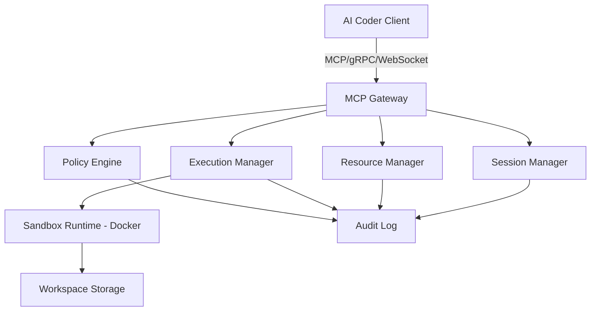

# Advanced MCP Server — PRD & System Architecture

## 1. Product Requirements Document (PRD)

### Overview

The Advanced MCP (Model Context Protocol) Server is designed to provide AI coding agents with a secure, flexible, and extensible environment for executing coding tasks. It allows multiple AI coders to connect, negotiate capabilities, run commands, access resources, and collaborate in a sandboxed, controlled environment.

### Objectives

* Provide a standardized protocol for AI coders to interact with development environments.
* Securely isolate execution through sandboxing (Docker-based).
* Enable extensibility via plugins/tools.
* Support multi-agent collaboration.
* Ensure auditability and safety through policy controls.

### Key Features

1. **Session Management** – Initialize and negotiate capabilities between AI and MCP server.
2. **Resource Management** – Secure file operations and persistent storage APIs.
3. **Tool Execution** – Run commands or tools in sandboxed environments with streaming logs.
4. **Policy Engine** – Enforce permissions, audit logs, and sandbox constraints.
5. **Multi-Agent Collaboration** – Allow multiple AI coders to connect to the same workspace.
6. **Extensible Tooling** – Support dynamically loadable tools (linters, compilers, frameworks).

---

## 2. System Architecture



### Components

* **MCP Gateway** – Accepts connections (gRPC + WebSocket for streaming).
* **Session Manager** – Handles authentication, session lifecycle, and capability negotiation.
* **Resource Manager** – File system abstraction with policy enforcement.
* **Execution Manager** – Runs commands/tools inside sandboxed runtimes (Docker).
* **Policy Engine** – Enforces access rules and maintains audit logs.
* **Audit Log** – Immutable logging system for accountability.
* **Sandbox Runtime** – Docker containers with controlled resources.
* **Workspace Storage** – Persistent project storage (bind-mounted or virtual FS).

---

## 3. API Surface

### Session APIs

* `InitSession(request: Capabilities) -> SessionInfo`
* `ListCapabilities() -> Capabilities`

### Resource APIs

* `GetFile(path) -> FileContent`
* `WriteFile(path, content) -> Status`
* `ListFiles(path) -> FileList`

### Execution APIs

* `RunCommand(command, args, options) -> Stream<Log|Result>`
* `CancelExecution(executionId) -> Status`

### Policy APIs

* `GetPolicies() -> PolicyList`
* `SetPolicy(policy) -> Status`

### Collaboration APIs

* `JoinWorkspace(workspaceId) -> SessionInfo`
* `BroadcastMessage(message) -> Ack`

---

## 4. Security Model

* **Sandbox Isolation** – Each AI coder runs commands in a separate Docker container.
* **Resource Policy** – Explicit allowlist for file operations and commands.
* **Auditability** – All actions logged with session ID, timestamp, and parameters.
* **Capability Negotiation** – Clients must declare supported tools/capabilities.
* **Rate Limiting** – Prevent misuse by throttling command execution.

---

## 5. Data Models

```ts
interface SessionInfo {
  sessionId: string;
  capabilities: string[];
}

interface FileContent {
  path: string;
  content: string;
}

interface ExecutionResult {
  executionId: string;
  exitCode: number;
  logs: string[];
}

interface Policy {
  id: string;
  rules: string[];
}
```

---

## 6. Roadmap

### Phase 1 (MVP)

* Session management
* File read/write
* Command execution in sandbox
* Basic logging

### Phase 2

* Policy engine
* Multi-agent collaboration
* Extensible tooling system

### Phase 3

* Advanced audit + monitoring
* SDKs (JS/Python)
* CLI for developers

---

## 7. Detailed API Spec

### OpenAPI Spec (YAML Skeleton)

```yaml
openapi: 3.0.3
info:
  title: MCP Server API
  version: 1.0.0
servers:
  - url: http://localhost:8080
paths:
  /session/init:
    post:
      summary: Initialize a session
      requestBody:
        required: true
        content:
          application/json:
            schema:
              $ref: '#/components/schemas/Capabilities'
      responses:
        '200':
          description: Session info
          content:
            application/json:
              schema:
                $ref: '#/components/schemas/SessionInfo'
components:
  schemas:
    Capabilities:
      type: object
      properties:
        tools:
          type: array
          items:
            type: string
    SessionInfo:
      type: object
      properties:
        sessionId:
          type: string
        capabilities:
          type: array
          items:
            type: string
```

### gRPC Proto Skeleton

```proto
syntax = "proto3";

service MCPServer {
  rpc InitSession(Capabilities) returns (SessionInfo);
  rpc ListCapabilities(Empty) returns (Capabilities);
  rpc GetFile(FileRequest) returns (FileContent);
  rpc WriteFile(FileContent) returns (Status);
  rpc RunCommand(CommandRequest) returns (stream ExecutionLog);
  rpc CancelExecution(ExecutionId) returns (Status);
}

message Capabilities {
  repeated string tools = 1;
}

message SessionInfo {
  string sessionId = 1;
  repeated string capabilities = 2;
}

message FileRequest {
  string path = 1;
}

message FileContent {
  string path = 1;
  string content = 2;
}

message CommandRequest {
  string command = 1;
  repeated string args = 2;
}

message ExecutionLog {
  string executionId = 1;
  string logLine = 2;
}

message ExecutionId {
  string executionId = 1;
}

message Status {
  bool success = 1;
  string message = 2;
}
```

---

## 8. Prototype Server Scaffold (TypeScript)

```ts
import express from 'express';
const app = express();
app.use(express.json());

// Session
app.post('/session/init', (req, res) => {
  const sessionId = Date.now().toString();
  res.json({ sessionId, capabilities: req.body.tools });
});

// Resource
app.get('/files/:path', (req, res) => {
  // TODO: sandboxed FS read
  res.json({ path: req.params.path, content: "// file content" });
});

// Execution
app.post('/execute', (req, res) => {
  // TODO: sandboxed exec
  res.json({ executionId: "exec-123", exitCode: 0, logs: ["started", "done"] });
});

app.listen(8080, () => console.log("MCP Server running on :8080"));
```

---

## 9. AI Development Requirements

For an AI to autonomously develop and maintain the MCP server, it needs:

### Environment Configuration

* **Dev containers**: Dockerfile + `docker-compose.yml`.
* **Pinned toolchain**: Node.js + TypeScript versions.
* **Preconfigured tooling**: ESLint, Prettier, Jest.
* **Git hooks**: enforce lint/tests before commit.

### Coding Conventions & Guidelines

* Style guide: naming, error handling, folder structure.
* Documentation: JSDoc/TSDoc required for all functions.
* Security rules: deny-by-default FS access, no external net by default.
* “Definition of Done”: feature is complete only when tested + documented.

### Testing Framework & Test Cases

* Jest/Mocha for unit tests.
* Integration test harness simulating client ↔ server ↔ sandbox.
* Pre-seeded tests (e.g., `RunCommand` returns logs within timeout).
* Coverage minimum: 80%.

### Release & Distribution

* Semantic versioning (SemVer).
* CI/CD pipelines (GitHub Actions/GitLab CI).
* SDK auto-build + publish.
* Documentation auto-generated from OpenAPI + gRPC.

### Feedback & Self-Improvement

* Error log collection with structured JSON.
* GitHub issue templates for bugs/features.
* AI self-review process: analyze logs, propose patches.

### Seed Examples & Recipes

* Prebuilt workflows:

  * Bootstrap a Next.js app.
  * Refactor existing repo.
  * Run & fix tests.
* These act as **ground truth scenarios** for validation.

---

## 10. AI Meta-Rules & Workflow Context

This defines **how the AI should behave** while building and maintaining the MCP server.

### Workflow Rules

* Always follow PRD + Roadmap as the **single source of truth**.
* Break work into **small, testable increments**.
* Each increment must include: code, tests, documentation, verification.
* Never leave dead code, TODOs, or partial implementations.

### Decision Rules

* If spec conflict arises → default to **security & simplicity**.
* If multiple valid approaches exist → prefer **standards (OpenAPI, gRPC, Docker)**.
* If stuck → draft a mini design doc before coding.

### Collaboration Model

* Treat development as a **team process**: open issues, write PRDs for new features, clear commit messages.
* Each change must include code + tests + docs + changelog update + security check.

### Governance

* **Deny by default**: no unrestricted network or FS access.
* **Audit everything**: every action logged with session ID and timestamp.
* **Traceability**: each feature links back to a PRD or roadmap item.

### Context Flow for AI

1. Load PRD + Roadmap + Dev Requirements.
2. Inspect current repo state.
3. Select next roadmap task.
4. Plan → implement → test → document.
5. Verify against “Definition of Done.”
6. Commit, push, release milestone if applicable.